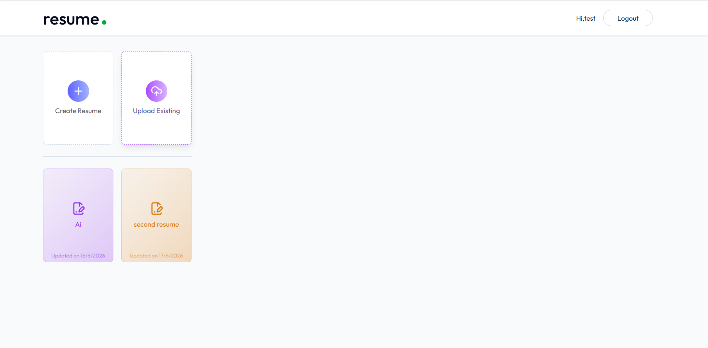
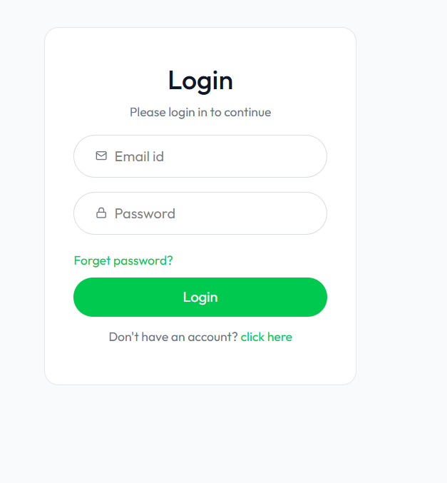

# 📝 Resume Builder

A Full Stack Web-Based Solution for **Dynamic Resume Generation and Career Profile Management**.

This project helps job seekers create professional, industry-standard resumes by providing structured input forms and generating polished **downloadable outputs**. It is designed with a scalable backend and a highly responsive layout, ready for future **AI-based content optimization and Enhancement in professional summary and job description**.

---

# 🌐 Live Demo

🔗 https://resumebuilderfront.netlify.app/

---

# 📸 Project Preview

## 🏠 Home Page

---

## 🎨 Ai Enhancement

## 📄 Existing Preview

## 📄 Login Page

---

# ✨ Features 📋

⚡️ **Clean Layouts** – Resumes optimized to pass through Applicant Tracking Systems.  
⚡️ **AI-Powered Summary & Job Tailoring** – Automatically enhance professional summaries and align your resume with a specific job description.  
⚡️ **Load Pre-existing Resume** – Upload or fetch your saved resume data to quickly edit and iterate.  
⚡️ **Dynamic Accent Color Picker** – Personalize your resume template with custom brand colors instantly.  
⚡️ **Print-Format PDF Downloads** – Clean, high-fidelity export perfectly calibrated for print or digital submission.  
⚡️ **Secure Login / Logout** – Protect and access your saved profile data from anywhere.  
⚡️ **Share Link** – Share Via Link Your Resume.  

---

# 🛠️ Tech Stack 💻

## 🎨 Frontend
✔️ React.js  
✔️ React Router DOM  
✔️ Axios  
✔️ CSS / Tailwind CSS  
✔️ HTML5 Canvas / jsPDF (for Print-Format PDF generation)  

---

## ⚙️ Backend
✔️ Node.js  
✔️ Express.js  
✔️ MongoDB  
✔️ Mongoose  
✔️ REST API Architecture  
✔️ CORS  

---

# 🚀 Deployment

## 🌐 Frontend Deployment
✔️ Netlify 

## ⚙️ Backend Deployment
✔️ Render  

---

# 🔐 Security Features

✔️ JWT Authentication (for secure user Login and Logout)  
✔️ Input Sanitization & Validation  
✔️ Environment Variables (.env protection)  
✔️ Secure API handling  
✔️ CORS protection  

---
